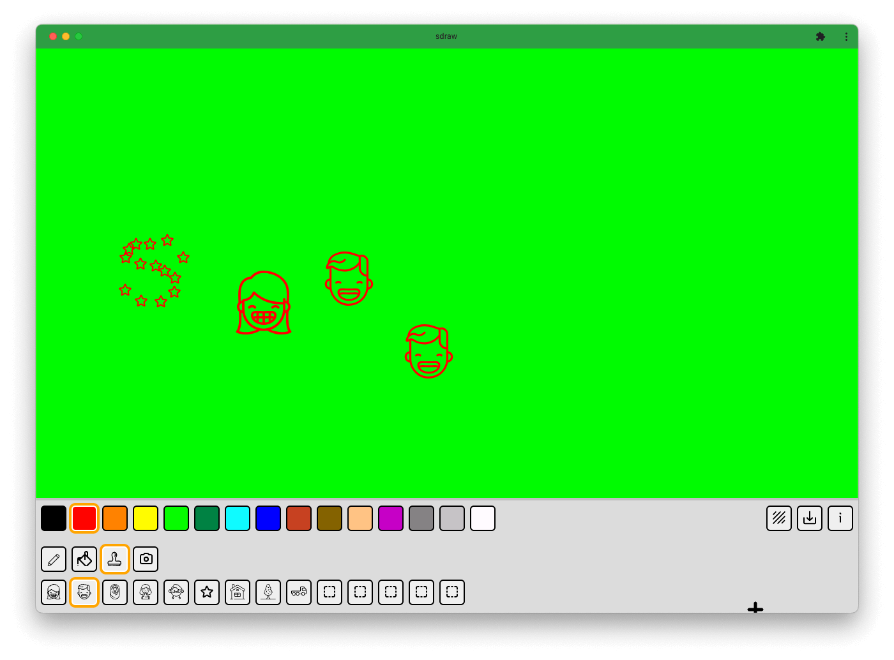

# sdraw

<div style="display: flex; align-items: flex-start;">

<div>
Simple drawing web program aimed for kids with accessibility in mind.
The program provides very simple functionality:

- pen tool
- bucket (fill) tool
- stamps (with ability to load in custom ones)
- photo capture

The cursor can be controlled with mouse, keyboard or gamepad. You can install this application via browser (PWA) and it will work offline just fine, there is no server component involved.

</div>
</div>



## Control mapping

### Keyboard

- arrow keys for movement
- `ENTER` for selecting buttons (tools, colors ...)
- `SPACE` for activating tool (to draw with pen, you need to hold it)
- `a`, `z` for cycling between colors
- `,`, `.` for cycling between tool variants
- `p` activate pen tool
- `f` activate bucket tool
- `c` activate photo capture
- `s` activate stamp tool

### Gamepad

- D-PAD for movement
- A button for selecting buttons and activating tool (hold for repeatedly activating it, e.g. drawing with pen)
- Right shoulder button / Left shoulder button - for cycling between colors
- Right trigger button / Left trigger button - for cycling between tool variants

## Installation

Upload source files to a folder on a web server ;)
You might want to exclude `node_modules/` if you're copying it after running developer tools.

## Development

Source code is written in regular Javascript for modern browsers that support ES module scripts.
NodeJS is only used for developer tooling (formatting and linting). To run development server, you need Python 3 to be installed and run this:

```shell
chmod +x server.sh
./server.sh
```

Or you can use any other dev server to load in `index.html` but it needs to be served over `http` (not `file://`) due to usage of ES modules.

- `npm run start` alias for running dev server
- `npm run format` formats files
- `npm run lint` runs linter

TODOs: https://github.com/users/comatory/projects/1
